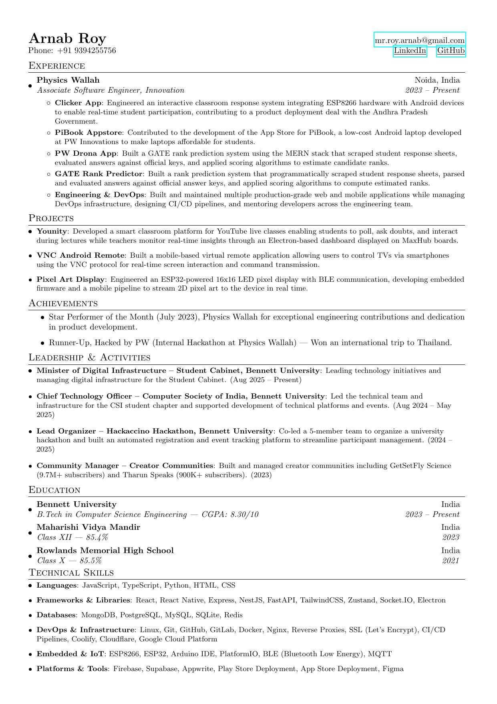

# Arnab Roy – Resume (LaTeX)

This repository contains the source code for my **resume written in LaTeX**.
The resume is built using a **clean and minimal template** designed for software engineering and technical roles.

---

## 📄 Download Resume

<p align="center">
  <a href="Arkadip-Das-Resume.pdf" download>
    
  </a>
</p>

---

## 📄 Resume Preview

<p align="center">
  
</p>

---

## 📂 Repository Structure

```
.
├── resume.tex      # Main LaTeX resume source
├── resume.pdf      # Compiled resume
├── resume.png      # Preview image used in README
├── README.md
└── .github/workflows
    └── build-resume.yml   # GitHub Actions workflow
```

---

## ⚙️ Automatic Build

This repository uses **GitHub Actions** to automatically:

1. Compile `resume.tex`
2. Generate `resume.pdf`
3. Convert the first page to `resume.png`
4. Update the preview in the README

Every time changes are pushed to `resume.tex`, the preview image is automatically refreshed.

---

## 🛠 Local Compilation

If you want to compile the resume locally:

```bash
pdflatex resume.tex
```

This will generate:

```
resume.pdf
```

---

## 👨‍💻 Author

**Arnab Roy**

* GitHub: https://github.com/arnabdotpy
* LinkedIn: https://linkedin.com/in/arnabroy25
* Email: [mr.roy.arnab@gmail.com](mailto:mr.roy.arnab@gmail.com)

---

## 📜 License

This repository is open for inspiration and educational purposes.
You are free to adapt the structure for your own resume.
